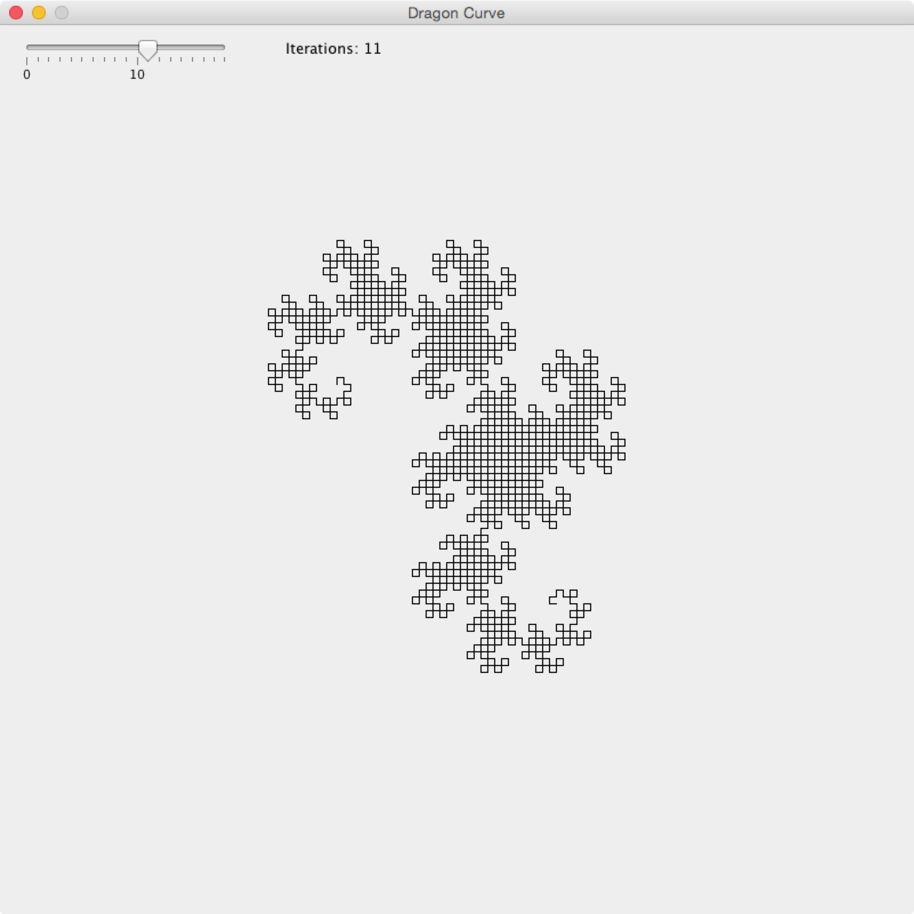

# DragonCurveDemo
A simple Java program to display a Dragon Curve of the n-th iteration.

##How to use
Simply drag the slider in the upper right corner to change the amount of iterations to calculate, and watch the Dragon Curve being generated!

##Download
An up-to-date .jar distribution (compiled with Java 7) is provided in the /dist folder of this repository.

